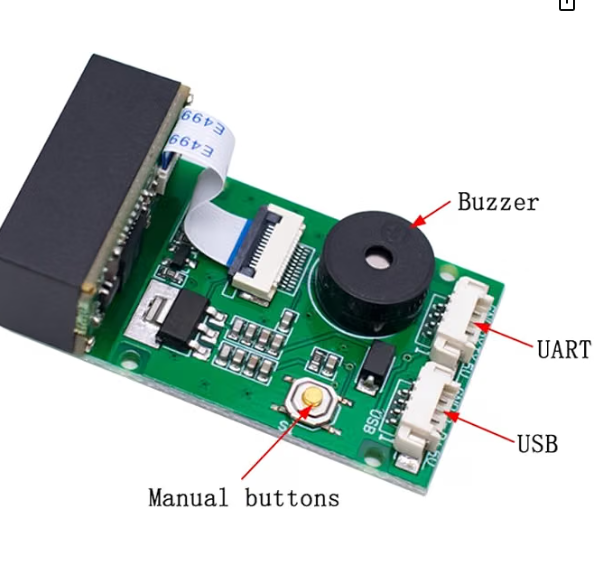

# Kitchen Barcode Scanner

*GM67 Scanner + ESP32 + Home Assistant — Build & Setup Guide*

## 1. Project Overview

This project wires a GM67 barcode/QR scanner module to an ESP32 development board so that scanning an item's barcode in the kitchen automatically adds it to a Home Assistant shopping list (a to-do list entity). When a barcode is scanned, the ESP32 reads the code over a serial (UART) connection, publishes it to Home Assistant, and an automation looks up the product name from a free online barcode database before adding it to the list.

**High-level flow:**

- GM67 scans a barcode and sends the number over UART to the ESP32.
- ESPHome firmware on the ESP32 reads the UART data and publishes it as a sensor in Home Assistant.
- A Home Assistant automation triggers on that sensor changing, looks up the barcode against an online product database, and adds the resulting item name to the shopping list.

## 2. Bill of Materials

| Item | Notes |
|---|---|
| ESP32 DevKit board | 30/38-pin dev board, ~52 x 28mm. Runs the ESPHome firmware. |
| GM67 barcode/QR scanner module | Engine board with separate physical UART and USB connectors, buzzer, and a manual scan button. |
| 4-pin JST cable | Usually included with the GM67 — connects to its UART port specifically (not the USB port). |
| 5V power supply | Powers both the ESP32 and the GM67 from a shared, stable source (not just a PC USB port, which can brown out under load). |
| Jumper wires / breadboard (optional) | For prototyping the wiring before finalizing into an enclosure. |

## 3. Wiring

The GM67 board used in this project has two separate physical connectors — one labelled UART and one labelled USB. Always use the UART connector for this project; the USB connector talks directly to a PC as a keyboard-emulation device and is not used here.



### Wiring table

| GM67 UART pin | ESP32 pin | Purpose |
|---|---|---|
| VCC | 5V | Power (confirm your module's voltage requirement before connecting) |
| GND | GND | Common ground — required for both power and reliable data signalling |
| TXD | GPIO16 (RX) | Scanner's data output → ESP32 receives |
| RXD | GPIO17 (TX) | Optional — only needed to send configuration commands to the scanner |

**Important notes learned during setup:**

- Trust the silkscreen labels printed on the GM67 board itself for TX/RX identification, not generic wire-color assumptions — cables bundled with these modules are frequently non-standard or mismatched in colour.
- Use a proper mating JST plug rather than bare wires pressed into the connector housing — a loose friction-fit connection can produce a weak or unstable signal that is very difficult to diagnose (readings that hover at a fraction of the supply voltage, rather than a clean high or low, are a strong sign of exactly this problem).
- Power both boards from a proper 5V supply capable of handling the scanner's illumination LED/laser briefly drawing extra current during a scan — a computer USB port alone can brown out under this load.

## 4. Configuring the GM67 for Serial Output

Many GM67 modules ship with their internal "Communication Interface" setting on a USB mode rather than Serial, even when wired into the UART connector. If the scanner beeps on every scan (confirming the decode engine works) but no data ever appears over UART, this setting is the most likely cause.

This can be fixed either of two ways:

- Scan the "Communication Interface: Serial" configuration barcode from the GM67's printed manual, if available.
- Or, send the equivalent raw command from the ESP32 itself over UART. The module must first be woken with a single `0x00` byte, followed by a short delay, before it will accept a configuration command:

```yaml
# Wake the scanner, then set Communication Interface = Serial
uart.write: [0x00]
delay: 50ms
uart.write: [0x08, 0xC6, 0x04, 0x08, 0x00, 0xF2, 0x01, 0x00, 0xFE, 0x33]
```

## 5. ESPHome Firmware Configuration

This is the full ESPHome YAML configuration flashed to the ESP32. It sends the wake-up/serial-mode command on boot, reads barcodes over UART, filters out non-printable bytes (which otherwise caused a UTF-8 crash when the scanner's line terminator byte was captured), and publishes clean barcode text to a Home Assistant sensor.

```yaml
esphome:
  name: kitchen-barcode-scanner
  friendly_name: Kitchen Barcode Scanner
  on_boot:
    priority: -100
    then:
      - uart.write:
          id: scanner_uart
          data: [0x00]
      - delay: 50ms
      - uart.write:
          id: scanner_uart
          data: [0x08, 0xC6, 0x04, 0x08, 0x00, 0xF2, 0x01, 0x00, 0xFE, 0x33]

esp32:
  board: esp32dev
  framework:
    type: arduino

logger:

api:
  encryption:
    key: !secret api_encryption_key

ota:
  - platform: esphome
    password: !secret ota_password

wifi:
  ssid: !secret wifi_ssid
  password: !secret wifi_password
  ap:
    ssid: "Kitchen Scanner Fallback Hotspot"
    password: !secret fallback_ap_password

captive_portal:

# --- UART link to the GM67 ---
uart:
  id: scanner_uart
  tx_pin: GPIO17   # GM67 RXD
  rx_pin: GPIO16   # GM67 TXD
  baud_rate: 9600

text_sensor:
  - platform: template
    id: last_barcode
    name: "Last Scanned Barcode"
    icon: mdi:barcode

# Poll the UART buffer, keep only printable ASCII characters, and publish
# a clean barcode string whenever a complete line is received.
interval:
  - interval: 200ms
    then:
      - lambda: |-
          static std::string buf;
          while (id(scanner_uart).available()) {
            uint8_t c;
            id(scanner_uart).read_byte(&c);
            if (c == '\r' || c == '\n') {
              if (!buf.empty()) {
                id(last_barcode).publish_state(buf);
                buf.clear();
              }
            } else if (c >= 0x20 && c <= 0x7E) {
              buf += (char) c;
            }
          }
```

*Replace the four `!secret` values in `secrets.yaml` with your own WiFi credentials and generated passwords/keys.*

## 6. Home Assistant Automation

This automation triggers whenever the "Last Scanned Barcode" sensor changes, looks up the barcode against a free online product database (UPCitemdb first, falling back to Open Food Facts for grocery items it misses), and adds the resulting product name to the shopping list.

```yaml
rest_command:
  lookup_barcode_upcitemdb:
    url: "https://api.upcitemdb.com/prod/trial/lookup?upc={{ barcode }}"
    method: GET
    timeout: 10
  lookup_barcode_openfoodfacts:
    url: "https://world.openfoodfacts.org/api/v2/product/{{ barcode }}.json?fields=product_name,brands"
    method: GET
    timeout: 10

automation:
  - alias: "Kitchen barcode scan -> add to shopping list"
    trigger:
      - platform: state
        entity_id: sensor.kitchen_barcode_scanner_last_scanned_barcode
    condition:
      - condition: template
        value_template: "{{ trigger.to_state.state not in ['unknown', 'unavailable', ''] }}"
    action:
      - service: rest_command.lookup_barcode_upcitemdb
        data:
          barcode: "{{ trigger.to_state.state }}"
        response_variable: upc_result
      - service: todo.add_item
        target:
          entity_id: todo.shopping_list
        data:
          item: >-
            
            
              {{ items[0].title }}
            
              Unknown item {{ trigger.to_state.state }}
            
```

*Note: if your shopping list uses the older Shopping List integration instead of the newer To-do list feature, use `shopping_list.add_item` instead of `todo.add_item`.*

## 7. Enclosure

Planned as a wall-mounted, fully enclosed 3D-printed case:

- Houses both the GM67 module and the ESP32 DevKit board.
- Mounts to the wall via screw holes through the back panel.
- Snap-fit lid for a clean, fully enclosed finish (no exposed screws on the front).
- Scanner positioned at a 45-degree angle, facing toward the floor, to make scanning items held below it more natural, while keeping the overall footprint as small as comfortably possible for the wiring inside.

## 8. Troubleshooting Notes

Issues encountered during setup, and their fixes, for reference:

- Scanner beeped on scan but no data reached the ESP32 → the GM67's Communication Interface was set to a USB mode rather than Serial; fixed by switching it to Serial (Section 4).
- ESPHome YAML `unknown tag !<!lambda>` errors → caused by inline `!lambda` tags in unsupported positions; resolved by keeping barcode-parsing logic inside plain `lambda:` blocks rather than inline templated fields.
- Crash / reset when a barcode was scanned → caused by a non-printable line-terminator byte breaking UTF-8 handling; fixed by filtering to printable ASCII characters only before publishing the sensor state.
- Unstable/partial voltage readings (neither a clean high nor a clean low) on a data line → sign of a poor physical connection, most often bare wires pressed into a JST housing rather than a proper crimped plug.
- For non-food household items not found in one barcode database, chaining a second free database as a fallback (e.g. Open Food Facts behind UPCitemdb) improves the hit rate.
- You will also need to use the following link to scan the QR code to set the barcode board into the correct mode (Scan the TTL 232 Interface barcode) https://www.f1depo.com/class/INNOVAEditor/assets/Gm67%20barkod%20okuyucu.pdf?srsltid=AfmBOopJu-ph7vJqrTv6X7E4oV92IjepMFx5j9hwHkwAmY2T3W3l_FnB
